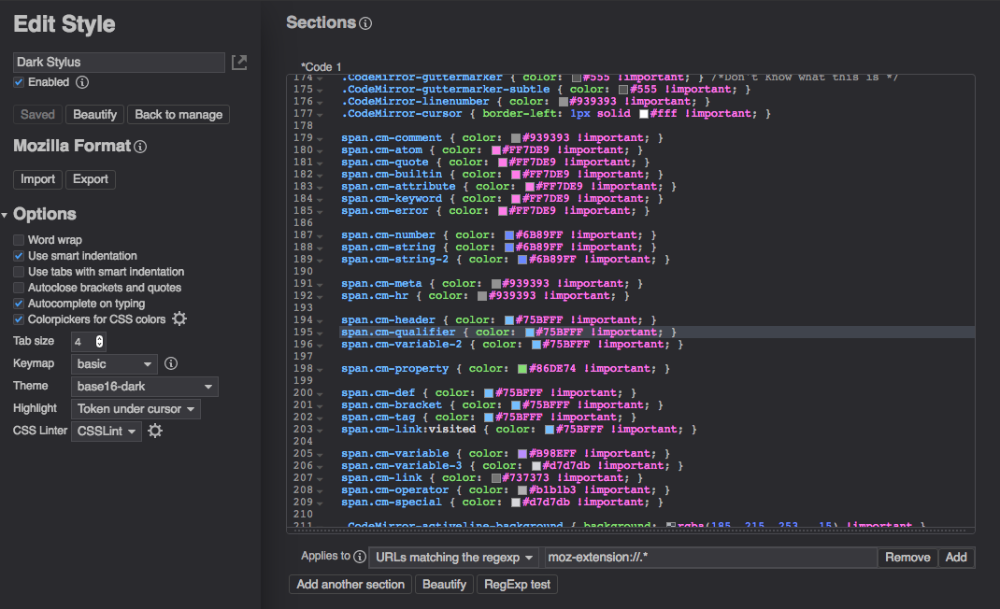

# Stylus-Dark

A dark theme designed for [Stylus](https://github.com/openstyles/stylus).

This dark theme is specifically designed to match the dark mode used by Firefox's inspector and browser toolbox.  Additionally, it is meant to compliment [ShadowFox](https://github.com/overdodactyl/ShadowFox) - a universal dark theme for Firefox.  

# Status

This theme is on its first release.  Please report any problems by opening a new [issue](https://github.com/overdodactyl/Stylus-Dark/issues) or messaging me on Reddit (u/overdodactyl).

# Sample Screenshots

